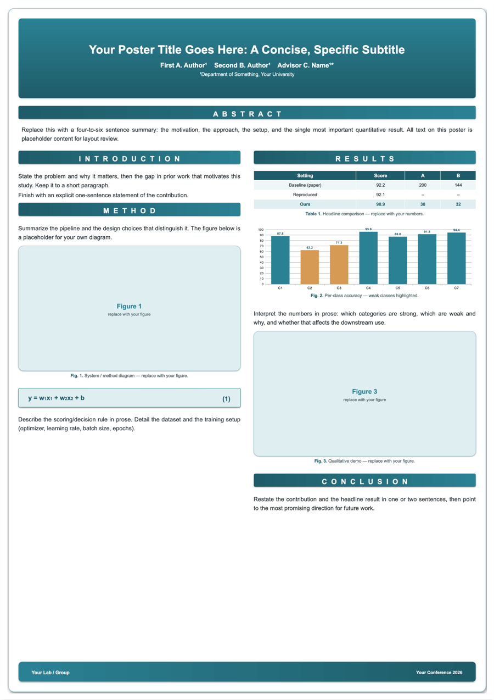

# academic-poster

> The academic poster builder that **measures your text so a section bar never covers your paragraph** — an overflow-proof flow layout, output as editable PowerPoint.

<p align="center">
  <a href="https://github.com/YJlang/academic-poster/stargazers"></a>
  <a href="LICENSE"></a>
  
  <a href="https://agentskills.io"></a>
  <a href="https://github.com/YJlang/academic-poster/issues"></a>
</p>

An **Agent Skill** that builds print-ready academic / conference posters
(A0 · A1 · A2) as a single **editable PPTX** slide — driven entirely by a config,
with a flow layout engine that *measures text* so sections never overlap or
overflow.

Works with any coding agent that supports the [Agent Skills](https://agentskills.io)
open standard (Claude Code, and others).

> 💡 If this saves you from fighting PowerPoint the night before a deadline, consider
> [starring the repo](https://github.com/YJlang/academic-poster) — it helps others find it.

<p align="center"></p>

> The image above is the bundled **dummy** example — every word/number is
> placeholder. You supply real content via a config; nothing is hard-coded.

## Why it's different
- **Flow layout, not fixed coordinates.** Each block is pushed down by the
  measured height of the one above it, so a long paragraph can never be covered
  by the next section bar. Text height is measured from font metrics (Pillow).
- **Editable output.** Native PowerPoint charts and tables (not screenshots),
  real text boxes, gradient/shadow styling via OOXML.
- **Content/engine separation.** All text, colors, figures, tables, and charts
  live in a config (dict/YAML). Re-skin the whole poster by changing a few hex
  colors.
- **Render-and-check loop.** A helper renders the PPTX to PNG/PDF with
  LibreOffice so you (or the agent) can actually look for overflow/clipping.
- **Battle-tested fixes baked in:** autofit-off (consistent font sizes),
  CJK font handling, app-bundled font discovery, macOS read-only (quarantine) fix.

## Install

This repo is the skill. The skill itself is the `academic-poster/` folder
(it contains `SKILL.md`).

**Claude Code**
```bash
# personal (all projects)
cp -r academic-poster ~/.claude/skills/academic-poster
# or per-project
cp -r academic-poster /path/to/project/.claude/skills/academic-poster
```
Then just ask for a poster — Claude loads the skill by its description. Or run
`/academic-poster`.

**Other agents (Agent Skills standard)**
Copy the `academic-poster/` folder into that tool's skills directory. The
`SKILL.md` frontmatter (`name`, `description`) follows the open standard.

**Python deps** (the scripts need these wherever they run)
```bash
pip install python-pptx Pillow PyYAML      # + LibreOffice for preview/PDF
```

## Quick start (without an agent)
```bash
cd academic-poster
python examples/demo_poster.py examples/config.example.yaml out.pptx
python scripts/render_preview.py out.pptx        # -> out.png (+ out.pdf)
# macOS: if PowerPoint opens it read-only
scripts/unlock_macos.sh out.pptx
```
Edit `examples/config.example.yaml` (or write your own) and re-run.

## Repo layout
```
academic-poster/            # ← the skill
├── SKILL.md                # entry point (workflow + principles + links)
├── reference/              # loaded on demand
│   ├── layout-engine.md    # flow + text measurement + safety factor
│   ├── pptx-techniques.md  # size/units, native charts & tables, OOXML, CJK fonts
│   ├── fonts-rendering.md  # autofit, app-bundled fonts, render loop
│   └── troubleshooting.md  # overflow, font substitution, read-only file, ...
├── scripts/
│   ├── poster.py           # the engine (Poster class)
│   ├── measure.py          # font-metric text measurement
│   ├── render_preview.py   # LibreOffice -> PNG/PDF (+ crop)
│   └── unlock_macos.sh     # strip com.apple.quarantine (macOS)
└── examples/
    ├── config.example.yaml # complete dummy poster config
    └── demo_poster.py      # build a poster from a config
```

## Notes
- macOS-specific helpers (quarantine, clipboard image extraction, app-bundled
  font paths) are documented as such; cross-platform equivalents are noted in
  the reference files.
- Built and refined while making a real conference poster; the project-specific
  content was intentionally stripped — only the reusable technique remains.

## Contributing
Issues and PRs are welcome — bug reports, new block types, more cross-platform
font paths, or non-macOS equivalents for the helper scripts. See
[CONTRIBUTING.md](CONTRIBUTING.md) for the dev setup, the render-and-look
verification loop, and the project principles. By participating you agree to the
[Code of Conduct](CODE_OF_CONDUCT.md).

## Star History

<a href="https://star-history.com/#YJlang/academic-poster&Date">
  
</a>

## License
[MIT](LICENSE).
